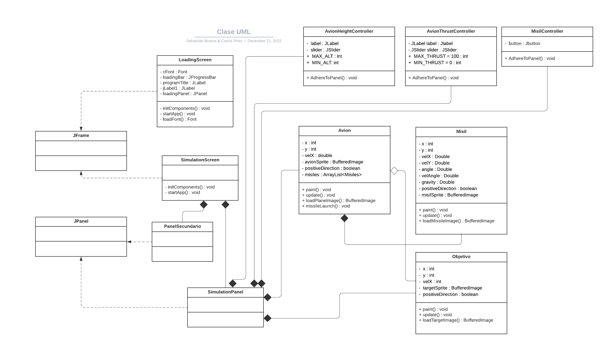
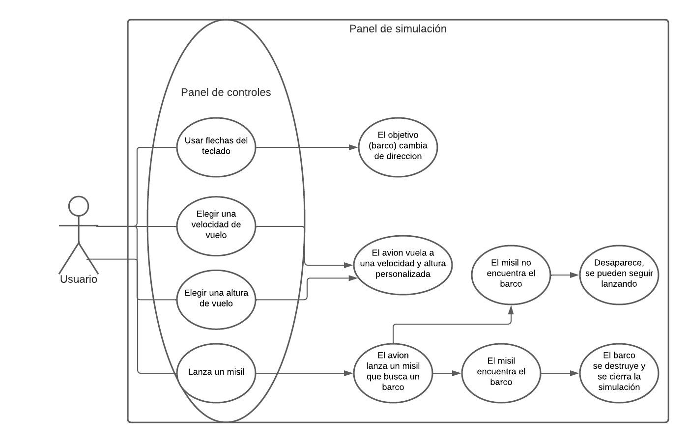

# ProyectoSemestral-Progra-II

> ([Informática UdeC](https://fi.udec.cl/pregrado/ingenieria-civil-informatica/) 2022-2)

### Grupo 21
- [Sebastián Benjamín Bustos Beni](https://github.com/sebasinmas)
- [Carlos Efraín Pinto Urtubia](https://github.com/CxrlosKenobi)

---

> Tema: Animación de la física de lanzamiento de misiles desde un avión

## Capturas de pantalla del proyecto

## Diagramas

### UML

### Casos de uso

## Decisiones de diseño  
### Patrones de diseño de software
Utilizamos varios patrones de diseño de software para la creación de la aplicación. Los más importantes, los cuales influyeron en la estructura del proyecto, fueron parte de los patrones **S.O.L.I.D.** entre otros como:

+ **Singleton** para la creación de la ventana de juego, ya que solo se puede tener una ventana de juego a la vez.
+ **Observer** para la creación de la clase `Game`, ya que esta clase debe notificar a las demás clases cuando se debe actualizar el juego.

Usamos también el principio de **separación de responsabilidades**, ya que cada clase tiene una única responsabilidad, y no se mezclan las funciones de una clase con otra. Así mismo aplicado a las carpetas, cada una tiene una única responsabilidad, y no se mezclan las funciones de una carpeta con otra.

### Desafíos
- Los principales desafíos que tuvimos durante el proyecto abarcaron principalmente la parte de la física dinámica con Java, las animaciones, y cómo último pero no menos importante, el flujo y control de versiones con Git. Si bien Git no fue un problema, lo fue la coordinación para las tareas a realizar y la asignación de estas.

### Conclusiones
- Consideramos que se pueden crear mejores animaciones, y vincular mejor los objetos, sin embargo nuestra inexperiencia en el tema nos impidió hacerlo en el tiempo que teníamos. También hubo problemas con la física dinámica, ya que no pudimos implementarla de la mejor manera, pero logramos hacerla funcionar.
- De todos modos logramos establecer un flujo de trabajo que nos permitió trabajar de manera paralela en distintas branches y luego unirlas en una sola branch principal mediante Pull Requests.
